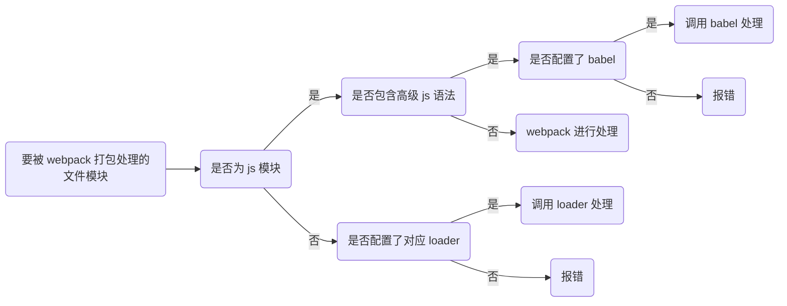

# webpack 入门教程

## 前言

前端工程化让前端开发能够自成体系，覆盖了前端项目从创建到部署的方方面面，极大程度提高了前端的开发效率。 

在企业级的前端项目开发中，把前端开发所需的工具、技术、流程、经验等进行规范化、标准化。最终落实到细节上，就是实现前端的四个现代化：  

* 模块化（js 的模块化、css 的模块化、其它资源的模块化）  
* 组件化（复用现有的 UI 结构、样式、行为）  
* 规范化（目录结构的划分、编码规范化、接口规范化、文档规范化、 Git 分支管理）  
* 自动化（自动化构建、自动部署、自动化测试）  

早期的前端工程化解决方案：  

* grunt（ https://www.gruntjs.net/ ）  
* gulp（ https://www.gulpjs.com.cn/ ）  

目前主流的前端工程化解决方案：  

* parcel（ https://zh.parceljs.org/ ）  
* webpack（ https://www.webpackjs.com/ ）  
* vite （ https://cn.vitejs.dev/ ）

本篇主要先介绍一下目前用得比较多的 webpack，后面会再介绍崛起中的 vite

## 什么是 webpack

* webpack 是前端项目工程化的具体解决方案  
* 提供了友好的前端模块化开发支持，以及代码压缩混淆、处理浏览器端 JavaScript 的兼容性、性能优化等强大的功能  
* 让程序员把工作的重心放到具体功能的实现上，提高了前端开发效率和项目的可维护性  


## webpack 的基本使用

### 创建列表隔行变色项目

* 新建项目空白目录，并运行 `npm init –y` 命令，初始化包管理配置文件 `package.json`  
* 新建 `src `源代码目录
* 新建 `src -> index.html` 首页和 `src -> index.js` 脚本文件  
* 初始化首页基本的结构

```html
<!DOCTYPE html>
<html lang="en">
  <head>
    <meta charset="UTF-8" />
    <meta http-equiv="X-UA-Compatible" content="IE=edge" />
    <meta name="viewport" content="width=device-width, initial-scale=1.0" />
    <title>Document</title>
  </head>
  <body>
    <ul>
      <li>这是第1个li</li>
      <li>这是第2个li</li>
      <li>这是第3个li</li>
      <li>这是第4个li</li>
      <li>这是第5个li</li>
      <li>这是第6个li</li>
      <li>这是第7个li</li>
      <li>这是第8个li</li>
      <li>这是第9个li</li>
    </ul>

    <script src="./index.js"></script>
  </body>
</html>
```

* 运行 `npm install jquery –S` 命令，安装 `jQuery`  
* 通过 `ES6` 模块化的方式导入 `jquery`，实现列表隔行变色效果  
* 
```js
import $ from 'jquery'

$(function () {
  $('li:odd').css('backgroundColor', 'red')
  $('li:even').css('backgroundColor', 'blue')
})
```

### 安装 webpack

```sh
npm i webpack webpack-cli -D
```

### 配置 webpack

* 在项目根目录中，创建名为 `webpack.config.js` 的 webpack 配置文件，并初始化如下的基本配置： 

```js
module.exports = {
  // 指定构建的模式，可选值有 development 和 production
  // development: 开发环境, 不会对打包生成的文件进行代码压缩和性能优化, 打包速度快，适合在开发阶段使用
  // production: 生产环境, 会对打包生成的文件进行代码压缩和性能优化, 打包速度很慢，仅适合在项目发布阶段使用
  mode: 'development' 
}
```
> `webpack` 在真正开始打包构建之前，会先读取 `webpack.config.js` 这个配置文件，从而基于给定的配置，对项目进行打包。  
> 由于 `webpack` 是基于 `node.js` 开发出来的打包工具，因此在它的配置文件中，支持使用 `node.js` 相关的语法和模块进行 `webpack` 的个性化配置。

* 在 `package.json` 的 `scripts` 节点下，新增 `dev` 脚本：  

```json
"scripts": {
  "dev": "webpack" // scripts 下的脚本，可以通过 npm run 名称 来执行，如：npm run dev 即 执行了 webpack 命令
}
```

* 在终端中运行 `npm run dev` 命令，启动 webpack 进行项目的打包构建
 
```sh
$ npm run dev

> webpack@1.0.0 dev
> webpack

asset main.js 323 KiB [emitted] (name: main)
runtime modules 937 bytes 4 modules
cacheable modules 282 KiB
  ./src/index.js 139 bytes [built] [code generated]
  ./node_modules/jquery/dist/jquery.js 282 KiB [built] [code generated]
webpack 5.73.0 compiled successfully in 400 ms
```

### webpack 默认的打包入口和出口

* 默认的打包入口文件为 `src -> index.js`
* 默认的输出文件路径为 `dist -> main.js`

我们可以通过 `entry` 节点修改打包的入口，通过 `output` 节点修改打包的出口。  

```js
const path = require('path')

module.exports = {
  // 指定打包的入口 
  entry: path.join(__dirname, './src/index.js'),
  // 指定打包的出口
  output: {
    // 表示输出文件的存放路径
    path: path.join(__dirname, './dist'),
    // 表示输出文件的名称
    filename: 'bundle.js',
  },
}
```

## webpack 中的插件

通过安装和配置第三方的插件，可以拓展 webpack 的能力，从而让 webpack 用起来更方便。

### webpack-dev-server  

`webpack-dev-server` 会启动一个实时打包的 http 服务器，可以让 webpack 监听项目源代码的变化，每当修改了源代码，会进行自动打包构建。  

* 安装:
   
```sh
npm i webpack-dev-server -D
```

* 修改 `package.json -> scripts` 中的 `dev` 命令： 
  
```json
"scripts": {
  "dev": "webpack serve" // scripts 下的脚本，可以通过 npm run 名称 来执行，如：npm run dev 
}
```

* 在 `webpack.config.js` 配置文件中，通过 `devServer` 节点对 `webpack-dev-server` 插件进行配置 

```js
devServer: {
  open: true, // 初次打包完成后，自动打开浏览器
  host: '127.0.0.1',  
  port: 80,
  static: {
    directory: path.join(__dirname, '/'),
  },
}

```

* 运行 `npm run dev` 命令，重新进行项目的打包  
  
* 在浏览器中访问 `http://localhost:8080` 地址，查看效果  


#### 注意事项

1. 打包生成的文件哪儿去了？

* 不配置 `webpack-dev-server` 的情况下，webpack 打包生成的文件，会存放到实际的物理磁盘上： 

  - 严格遵守开发者在 `webpack.config.js` 中指定配置  
  - 根据 `output` 节点指定路径进行存放  

* 配置了 `webpack-dev-server` 之后，打包生成的文件存放到了内存中  

  - 不再根据 `output` 节点指定的路径，存放到实际的物理磁盘上
  - 提高了实时打包输出的性能，因为内存比物理磁盘速度快很多

2. 生成到内存中的文件该如何访问？

* `webpack-dev-server` 生成到内存中的文件，默认放到了项目的根目录中，而且是虚拟的、不可见的。

  - 可以直接用 / 表示项目根目录，后面跟上要访问的文件名称，即可访问内存中的文件  
  - 例如 /bundle.js 就表示要访问 `webpack-dev-server` 生成到内存中的 `bundle.js` 文件

3. 凡是修改了 `webpack.config.js` 配置文件，或修改了 `package.json` 配置文件，必须重启实时打包的服务器，否则最新的配置文件无法生效！

### html-webpack-plugin

`html-webpack-plugin` 是 webpack 中的 HTML 插件，可以通过此插件自定制 `index.html` 页面的内容。  

可以通过 `html-webpack-plugin` 插件，将 `src` 目录下的 `index.html` 首页，复制一份到项目根目录中。

* 安装:
   
```sh
npm i html-webpack-plugin -D
```

* 修改 `webpack.config.js` 配置文件  

```js
const HtmlPlugin = require('html-webpack-plugin')

const htmlPlugin = new HtmlPlugin({
  template: './src/index.html',
  filename: './index.html',
})

module.exports = {
  mode: 'development',
  plugins: [htmlPlugin]
}
```

* 通过 HTML 插件复制到项目根目录中的 index.html 页面，也被放到了内存中  

* HTML 插件在生成的 index.html 页面的底部，**自动注入了打包的 bundle.js 文件**  

## webpack 中的 loader

### loader 概述

`webpack` 默认只能打包处理以 `.js` 后缀名结尾的模块。其他非 `.js` 后缀名结尾的模块，`webpack` 默认处理不了，需要调用 `loader` 加载器才可以正常打包，否则会报错！

`loader` 的作用就是 协助 webpack 打包处理特定的文件模块，比如：  

* `css-loader` 可以打包处理 `.css` 相关的文件
* `less-loader` 可以打包处理 `.less` 相关的文件
* `babel-loader` 可以打包处理 `webpack` 无法处理的 `高级 JS 语法`

> 注： `Babel` 是一个 `JavaScript` 编译器，它是一个工具链，主要的用途就是在旧的浏览器或环境中将 `ECMAScript 2015+` 代码转换为向后兼容的 js 代码。

### loader 调用过程




### 处理 css 文件

* 安装处理 css 文件的 loader: `style-loader` `css-loader`   

```sh
npm i style-loader css-loader -D
```

* 在 `webpack.config.js` 的 `module -> rules` 数组中，添加 loader 规则：  

```js
module: {   // 第三方文件模块的匹配规则
  rules：[  // 文件后缀名的匹配规则
    { test: /\.css$/, use: ['style-loader', 'css-loader'] }
  ]
}
```
> `test` 表示匹配的文件类型   
> `use` 表示对应要调用的 `loader`,  多个 loader 的调用顺序是：**从后往前调用**, 需要填写正确的顺序  

配置好之后我们就可以通过 import 导入 CSS 文件  

```js
import './css/index.css'
```

### 处理 less 文件

* 安装处理 less 文件的 loader: `less-loader`

```sh
npm i less-loader less -D
```

* 在 `webpack.config.js` 的 `module -> rules` 数组中，添加 loader 规则： 

```js
module: {   // 第三方文件模块的匹配规则
  rules：[  // 文件后缀名的匹配规则
    { test: /\.css$/, use: ['style-loader', 'css-loader'] },
    { test: /\.less$/, use: ['style-loader', 'css-loader', 'less-loader'] }
  ]
}
```

配置好之后我们就可以通过 import 导入 less 文件  

```js
import './css/index.less'
```

### 处理图片路径相关的文件

`file-loader`: 可以指定要复制和放置资源文件的位置，以及如何使用版本哈希命名以获得更好的缓存。这意味着 你可以就近管理图片文件，可以使用相对路径而不用担心部署时 URL 的问题。使用正确的配置，webpack 将会在打包输出中自动重写文件路径为正确的 URL。  

`url-loader`: 可以允许你有条件地将文件转换为内联的 base-64 URL (当文件小于给定的阈值)，这会减少小文件的 HTTP 请求数。如果文件大于该阈值，会自动的交给 `file-loader` 处理。所以使用 `url-loader` 的时候也需要安装 `file-loader`

* 安装 `file-loader` `url-loader` ：

```sh
npm i file-loader url-loader -D
```

* 在 `webpack.config.js` 的 `module -> rules` 数组中，添加 loader 规则： 

```js
module: {   // 第三方文件模块的匹配规则
  rules：[  // 文件后缀名的匹配规则
    { test: /\.css$/, use: ['style-loader', 'css-loader'] },
    { test: /\.less$/, use: ['style-loader', 'css-loader', 'less-loader'] },
    // { test: /\.(jpe?g|png|gif)$/, use: 'url-loader?limit=10240'}
    { test: /\.(jpe?g|png|gif)$/, use: {
      loader: 'url-loader',
      options: {
        limit: 10240,
        outputPath: 'image',
        name: '[name]-[hash:6].[ext]'
        }
      }
    }
  ]
}
```
> 注： 上面两种配置参数的方式都可以 ( 文件大于limit值时，`url-loader` 会自动的交给 `file-loader` 处理, 无需再配置 `file-loader` )

> `limit` 用来指定图片的大小，单位是字节（byte），只有 `≤ limit` 大小的图片，才会被转为 `base64` 格式的图片   

> `outputPath`  指定打包后图片的存储位置，这里即： 根目录下的 dist/image 下

> `name`: 对原来文件的进行重命名，这是使用 `原来名字 + 6位hash + 原来的扩展名`

配置之后我们就可以把图片当模块，通过 import 导入，并且打包的时候 webpack 会自动找打包好的文件路径，不需要再重新修改路径  

```js
import logo from './src/img/logo.png'

$('.logo').attr('src', logo)
```

### 处理 js 文件中的高级语法

webpack 只能打包处理一部分高级的 JavaScript 语法。对于那些 webpack 无法处理的高级 js 语法，需要借助于 `babel-loader` 进行打包处理。

* 安装 `babel-loader` 相关的包

```sh
npm i babel-loader @babel/core @babel/plugin-proposal-class-properties -D
```

* 在 `webpack.config.js` 的 `module -> rules` 数组中，添加 loader 规则： 

```js
module: {   // 第三方文件模块的匹配规则
  rules：[  // 文件后缀名的匹配规则
    { test: /\.css$/, use: ['style-loader', 'css-loader'] },
    { test: /\.less$/, use: ['style-loader', 'css-loader', 'less-loader'] },
    // { test: /\.(jpe?g|png|gif)$/, use: 'url-loader?limit=10240'}
    { test: /\.(jpe?g|png|gif)$/, use: {
      loader: 'url-loader',
      options: {
        limit: 10240,
        outputPath: 'image',
        name: '[name]-[hash:6].[ext]'
        }
      }
    },
    {
      test: /\.js$/,
      // 不处理该匹配项下的 js 文件
      exclude: /node_modules/,
      use: {
        loader: 'babel-loader',
        options: {
          // 声明一个 babel 插件， 用来转化 class 中的高级语法
          plugins: ['@babel/plugin-proposal-class-properties']
        }
      }
    }
  ]
}
```

配置完就能处理如下代码： 

```js
class Person {
  static info = 'person info'
}

console.log(Person.info)
```

## 打包发布

开发环境下，打包生成的文件不会进行代码压缩和性能优化，并且生成的文件存放于内存中，无法获取到最终生成的文件。     

为了让项目能够在生产环境中高性能的运行，我们需要在 `production` 模式下对项目进行打包发布。

1. 配置 `webpack` 的打包发布

* 在 `package.json` 文件的 `scripts` 节点下，新增 `build` 命令：

```json
"scripts": {
  "dev": "webpack serve", // 开发环境中，运行 dev 命令
  "build": "webpack --mode production" // 项目发布时，运行 build 命令
}
```

> `--model` 是一个参数项，用来指定 webpack 的运行模式。`production` 代表生产环境，会对打包生成的文件进行代码压缩和性能优化。

> 通过 `--model` 指定的参数项，会覆盖 `webpack.config.js` 中的 `model` 选项。

2. 把 `JavaScript` 文件统一生成到 js 目录中

* 在 `webpack.config.js` 配置文件的 `output` 节点中，进行如下的配置：

```js
output: {
  path: path.join(__dirname, 'dist'),
  // 
  filename: 'js/bundle.js'
}
```

3. 把图片文件统一生成到 `image` 目录中

* 上面的 `url-loader` options 中的 outputPath 已经配置好

4. 每次打包发布时, 自动清理 `dist` 目录下的旧文件

* 安装 `clean-webpack-plugin` 插件

```sh
npm i clean-webpack-plugin -D
```

* 修改 `webpack.config.js` 配置文件 

```js
const { CleanWebpackPlugin } = require('clean-webpack-plugin')
const cleanPlugin = new CleanWebpackPlugin()

module.exports = {
  mode: 'development',
  plugins: [
    // htmlPlugin, 
    cleanPlugin
  ]
}
```

## Source Map

生产环境下打包后的 JavaScript 源代码是压缩混淆过的，变量被替换成没有任何语义的名称，空行和注释被剔除等，这对于出错时的调试是及其困难的。  

Source Map 文件中存储着代码压缩混淆前后的对应关系，是一个储存着位置信息的文件。  

有了它，出错的时候，工具将直接显示原始代码，而不是转换后的代码，能够极大的方便后期的调试。  

### 开发环境下的 Source Map

在开发环境下，webpack 默认启用了 `Source Map` 功能。当程序运行出错时，可以直接在控制台提示错误行的位置，并定位到具体的源代码。

但是记录的是打包生成后的代码的位置，会导致运行时报错的行数与源代码的行数不一致的问题。

开发环境下，在 `webpack.config.js` 中添加如下的配置，即可保证运行时报错的行数与源代码的行数保持一致：  

```js
module.exports = {
  mode: 'development',
  devtool: 'eval-source-map',
  // ...
}
```

> 注意：`eval-source-map` 会使 运行时报错的行数与源代码的行数保持一致，请确保只在 开发模式 下使用  

### 生产环境下的 Source Map

在生产环境下，如果省略了 devtool 选项，则最终生成的文件中不包含 Source Map。这能够防止原始代码通过 Source Map 的形式暴露出去。

在生产环境下，如果只想定位报错的具体行数，且不想暴露源码。此时可以将 devtool 的值设置为 `nosources-source-map`。  

在生产环境下，如果想在定位报错行数的同时，展示具体报错的源码。此时可以将 devtool 的值设置为 `source-map`。

```json
"scripts": {
  "dev": "webpack serve", // 开发环境中，运行 dev 命令
  "build": "webpack --mode production --devtool nosources-source-map" // 项目发布时，运行 build 命令
}
```

### Source Map 最佳设置

* 开发环境下：  
  * 把 `devtool` 的值设置为 `eval-source-map`  
  * 好处：可以精准定位到具体的错误行  

* 生产环境下：  
  * 关闭 `Source Map` 或将 `devtool` 的值设置为 `nosources-source-map`  
  * 好处：防止源码泄露，提高网站的安全性  


## 总结

以上是 webpack 的简单配置及使用，我们只需要简单掌握基本的使用方法，

* 了解 `webpack.config.js` 相关配置项
* 了解 `plugin` 的基本使用
* 了解 `loader` 的基本使用
* 了解 `Source Map` 的作用

即可，实际开发中，我们都是使用 `脚手架 CLI` 工具，直接生成带有配置好的 webpack 项目，我们只需要根据自己项目的需求进行相关定制即可  

比如开发 vue 项目时，如果使用 webpack，则可以使用对应的脚手架 [`vue-cli`](https://cli.vuejs.org/zh/) 

`vue-cli` 内部封装了 webpack, 对外仅仅提供几个依赖, 而且做了很多适合 vue 项目的优化，同时你可以用 vue.config.js 来管理项目。

关于 `vue-cli` 的具体使用，请查看官网 [https://cli.vuejs.org/zh/](https://cli.vuejs.org/zh/)。
